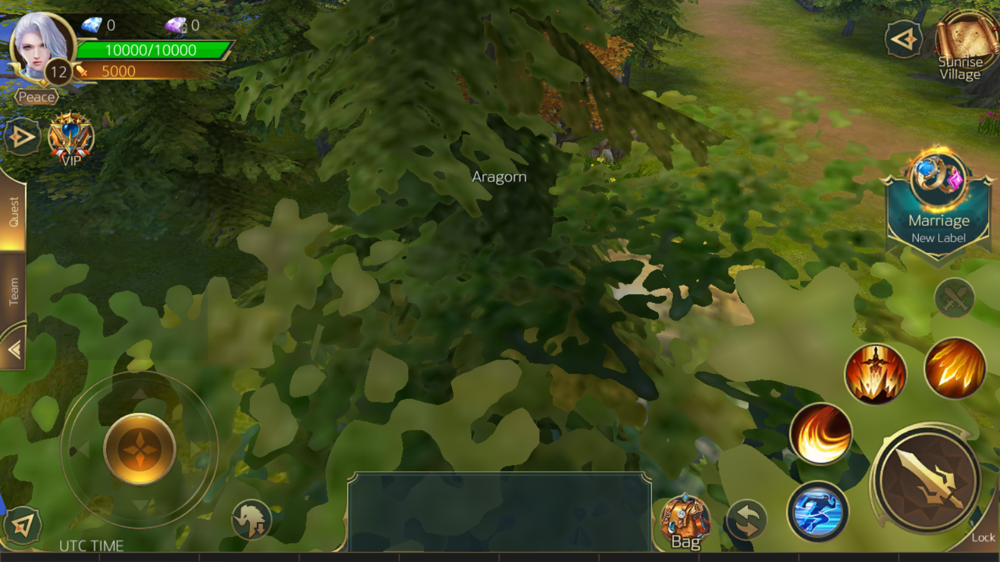
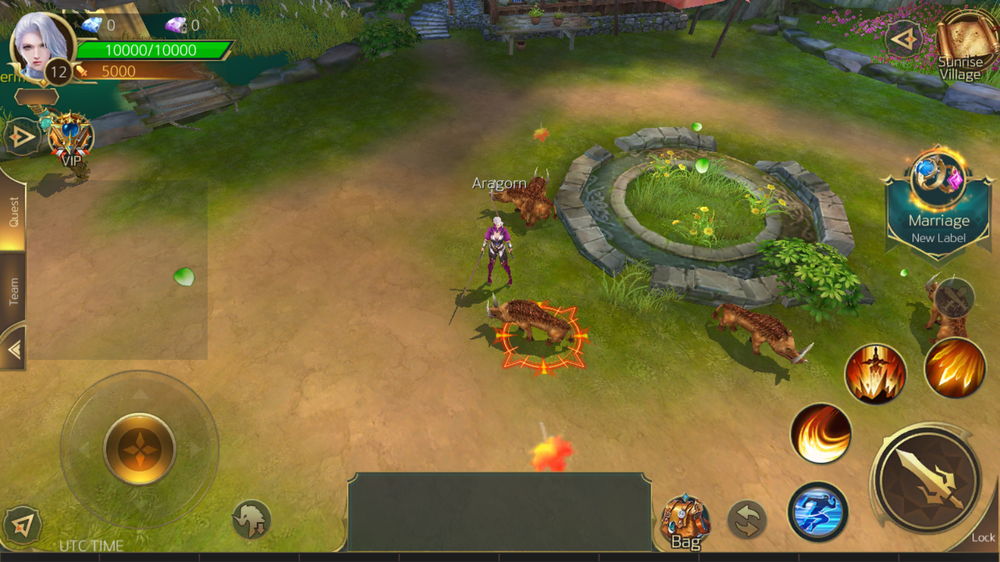

# Legacy of Destiny — Private Server (Reverse-Engineering Project)

A clean-room **private server** for *Legacy of Destiny*, a shut-down Android MMORPG.
Built by reverse-engineering the decompiled client, it drives the **unmodified
game** from a dead login screen all the way into a living, populated game world.

> **Status:** the real client connects, logs in, creates/selects a character,
> enters the world, walks around, and sees the map populated with monsters, NPCs,
> and teleports — all served by this from-scratch server. Combat is next.

| Character select | In the world | Populated village |
|---|---|---|
|  |  |  |

*(All gameplay is running against this private server — the original game's backend no longer exists.)*

---

## ⚠️ Disclaimer

This is an **educational / preservation** project for a game that has been shut
down and removed from stores. **No copyrighted game assets, binaries, or code are
included in this repository** — only my own server implementation and analysis.
Running it requires a copy of the original client, which is not provided. All
rights to *Legacy of Destiny* belong to its developers/publishers.

---

## What makes this interesting

The original servers are gone, so there was nothing to talk to. The challenge was
to reconstruct a server purely from the client:

- **The client decompiled to Mono + [SLua](https://github.com/pangweiwei/slua)**,
  so its game logic survived as ~1,500 plaintext Lua scripts and ~200 content
  tables — but the *server* behavior was never shipped and had to be re-derived.
- **The wire protocol is fully self-documenting in the client's Lua.** Rather than
  hand-port ~560 message definitions, the server **embeds a Lua 5.1 runtime and
  runs the client's own serialize/deserialize code** against a Python port of the
  client's byte buffer — so the wire format is guaranteed byte-compatible and can
  never drift.
- A custom **double-Base64 obfuscation** guarded the server-list payload; I ported
  the exact transform and verified it by round-tripping against the client's own
  routine.
- Cross-checking everything against the **real, unmodified client** running on a
  rooted emulator, using a DNS + TLS redirect and a one-line Lua hot-patch to
  bypass a third-party login SDK.

## How it works

```
                    ┌─────────────────────────── this repo ───────────────────────────┐
 unmodified client  │  bootstrap.py (HTTPS)  ── server list / package info             │
   (rooted emulator)│       │                                                           │
        │  hosts +  │       └── obfuscated server-list codec (serinfo.py)               │
        │  system CA│                                                                   │
        ├──HTTPS────┤  gateway.py (asyncio TCP)                                         │
        │           │       ├── 10-byte framing + dispatch by "servantname" (opcode)    │
        └──TCP──────┤       ├── luaproto.py  ── runs the CLIENT'S OWN Lua to (de)serialize│
                    │       ├── codec.py     ── byte-exact port of the client buffer     │
                    │       ├── content.py   ── builds a map's full AOI population        │
                    │       └── handlers: login, char create/select, enter-world,        │
                    │                     movement, teleport, server-time, AOI           │
                    └───────────────────────────────────────────────────────────────────┘
```

The original backend was a KBEngine/BigWorld-style distributed system
(`globalmgr` / `dbmgr` / `cellapp` / `gateway`); the client only ever connects to
the **gateway**, so this single process emulates that one endpoint and fakes the
rest.

## The build, milestone by milestone

| | Milestone | Result |
|---|---|---|
| M0 | Protocol + tooling | Byte-exact buffer port; Lua-reuse (de)serialization for all ~560 messages |
| M1 | HTTP bootstrap | Reproduced the obfuscated server-list; client lists & connects |
| M2 | Gateway + login | TCP framing, dispatch, account register + login handshake |
| M3 | Character select → world | Char list, create/select, enter-world, stable connection |
| M4 | Movement | Walk around (fixed the spawn-coordinate scaling) |
| M5 | AOI / world population | Monsters, NPCs, teleports spawned at real coordinates |
| M6 | Combat | *next* |

Full technical write-up in [`docs/`](docs/) — protocol spec, server architecture,
and the client-redirect methodology.

## Tech

Python 3 · `asyncio` (TCP gateway) · `lupa` (embedded Lua 5.1) ·
`cryptography`/OpenSSL (dev CA for HTTPS) · `adb`/Android emulator for client testing.

## Running it (high level)

The original client isn't included, so this is a description rather than a
turn-key setup:

```bash
cd server
pip install -r requirements.txt
python gateway.py        # TCP gateway
python bootstrap.py      # HTTPS server-list stub
python testclient.py     # a stand-in client that exercises the login flow end-to-end
```

`testclient.py` performs the real login handshake without any game files, so the
server can be validated on its own. See [`server/README.md`](server/README.md) and
[`docs/03-CLIENT-REDIRECT.md`](docs/03-CLIENT-REDIRECT.md) for driving the actual
client on an emulator.

## Repo layout

```
server/   Python server: codec, Lua-proto bridge, gateway, bootstrap, content, tools
docs/     Reverse-engineering write-up (protocol, architecture, redirect) + screenshots
```
